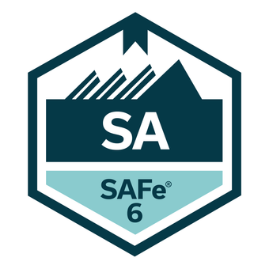

# Data Analytics Professional

## Education
- **Master of Science in Industrial Engineering**
TMU (2007)

- **Information Systems and Business Analysis**
HEC Montreal (2017, Top Student)

## Certifications
 **Certified Azure AI Engineer Associate**, Microsoft (6/2024)
 

 **Advanced Data Analytics**, Google (3/2024)
 

 **Certified SAFe 6 Agilist**, Scaled Agile (7/2023)
 

 **Change Management Practitioner**, PROSCI (8/2019)
 

 **Certified BA Professional (CBAP)**, IIBA (1/2016)
 

## Skills
**Analytical**: Machine Learning (Model Development, Training, Testing/Validation, Evaluation and Deployment), Predictive Models, Natural Language Processing (LLM), Statistics, Mathematical Modeling, Operations Research, Cloud AI Platforms, Exploratory Data Analysis, Data Modeling, Visualization and Manipulation.

**Technical**: Microsoft Azure ML and AI, Python (NumPy, Pandas, Matplotlib, Scikit-learn, Seaborn), JupyterLab, SQL, Tableau, GIT, REST APIs, JIRA (JQL), MS Excel, PowerPoint, Visio.

## Experience
**TD Insurance** (11/2016 – Present)

*Sr. Business Analyst and BA Specialist*
- Analyzed complex business problems, and proactively identified and engaged impacted stakeholders to align on desired outcomes.
- Led E2E needs analysis and developed comprehensive requirements for varied business/technical partners in various regulatory and non-regulatory high-impact initiatives
- Supported testing efforts to ensure adequate test coverage and proper analysis and resolving defects.

*Business Systems Analyst*
- Led system requirements analysis and delivery during 3 releases of TDI's biggest transformational program (GPS) for various API and technical delivery teams.
- Improved quality by 42% (less defects) and increased velocity by 21% of Agile pod.
- Became the point of reference shortly after joining the pod by developing overarching yet simplified technical specifications for managed APIs to support the team to deliver with impact and quality.

**TAM IKCO** (1/2012 – 4/2015)

*Business Systems Analysis and Process Management Supervisor*
- Designed and implemented a statistically unbiased HR Performance Measurement system.
- Defined and monitored KPIs, analyzed process analytics, and championed data-informed improvement initiatives.
- Analyzed process analytics and presented performance reports leading to strategic change initiatives.
- Developed and presented (to executives) insightful analytical reports/dashboards that empowered operational and strategic decisions.

**Misc. Companies** (2004 – 2012)

*Mgmt. Consultant, Process Engineer, Operations and Project Planning/Control.*

## Projects

